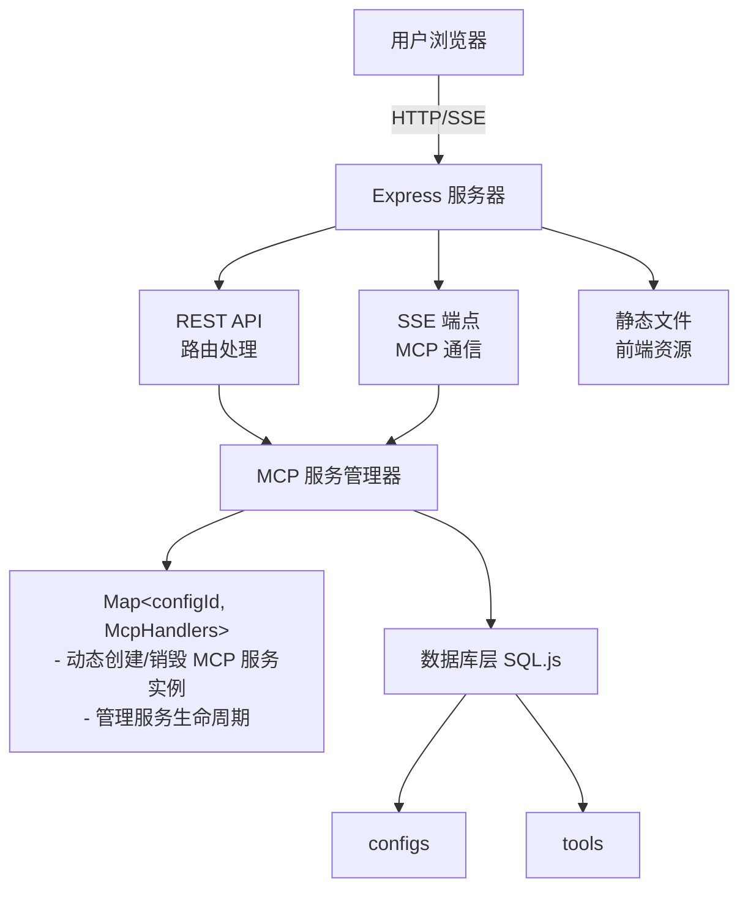
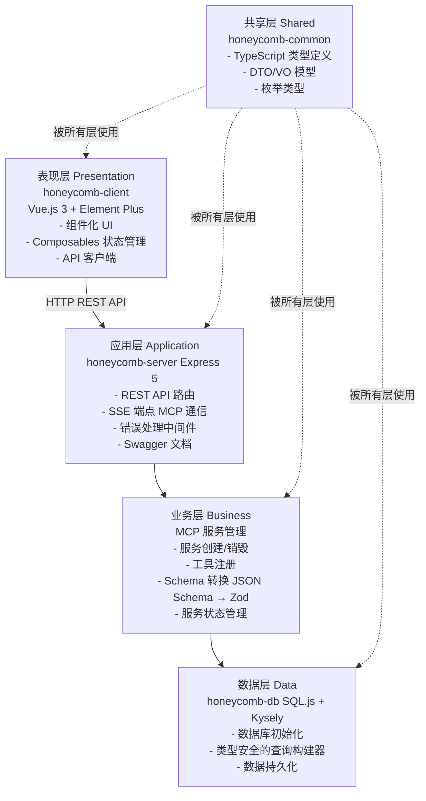
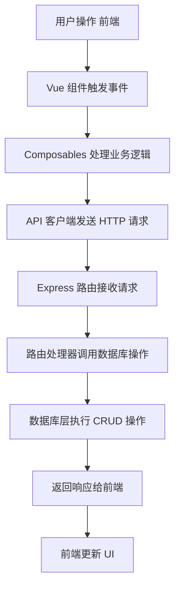
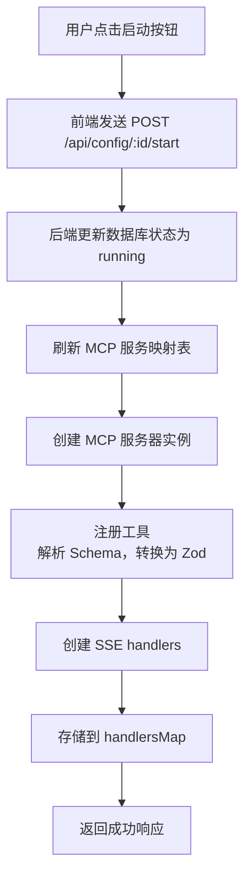
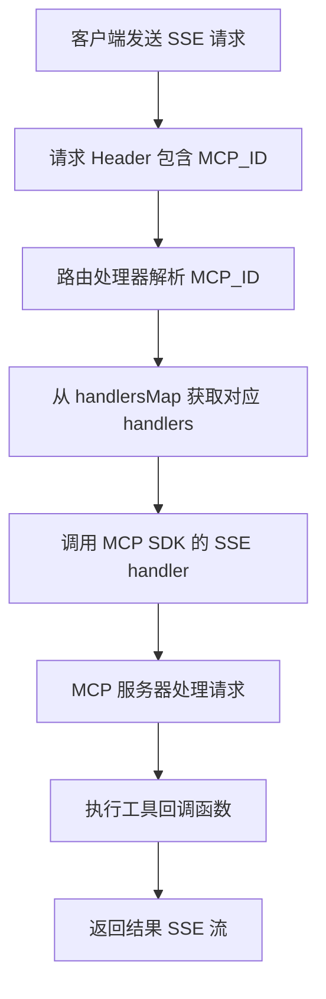
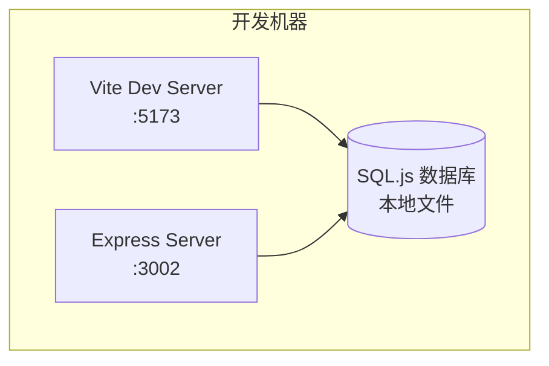
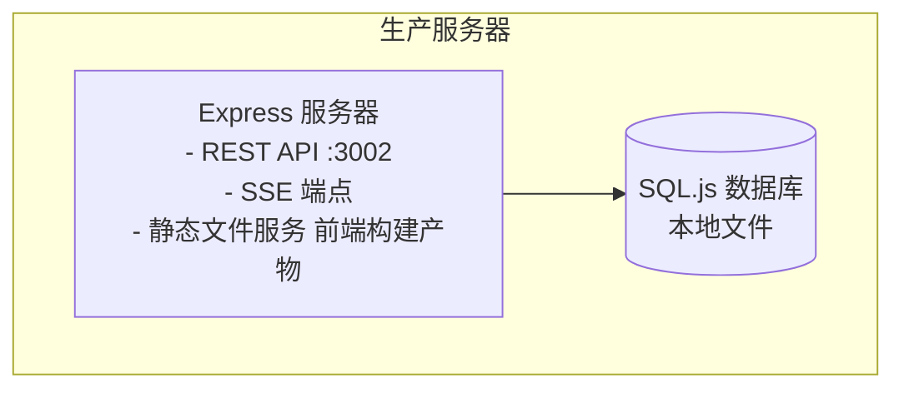

# Honeycomb 架构说明文档

## 📋 目录

- [项目概述](#项目概述)
- [整体架构](#整体架构)
- [技术栈](#技术栈)
- [模块说明](#模块说明)
- [数据流](#数据流)
- [核心功能](#核心功能)
- [部署架构](#部署架构)
- [开发规范](#开发规范)

## 项目概述

Honeycomb 是一个基于 Model Context Protocol (MCP) 的服务配置管理平台，提供可视化的 MCP 服务配置和管理功能。项目采用 Monorepo 架构，使用 pnpm workspace + Turbo 进行构建和依赖管理。

### 核心特性

- 📊 **可视化配置界面**：基于 Vue.js 3 + Element Plus 的现代化 UI
- 🔧 **服务管理**：MCP 服务的创建、编辑、启动和停止
- 🛠️ **灵活的工具配置**：支持自定义工具回调函数，灵活配置输入/输出 Schema
- 📚 **API 文档**：集成 Swagger UI，提供完整的 API 文档
- 💾 **本地数据持久化**：基于 SQL.js 的轻量级数据库，无需额外数据库服务
- 🏗️ **Monorepo 架构**：使用 pnpm workspace + Turbo 构建的高效开发体验

## 整体架构

### 架构图



### 分层架构



## 技术栈

### 前端技术栈

| 技术 | 版本 | 用途 |
|------|------|------|
| Vue.js | 3.x | 前端框架 |
| Element Plus | - | UI 组件库 |
| Vite | - | 构建工具 |
| TypeScript | 5.9.3 | 类型系统 |
| Vitest | 4.0.17 | 单元测试 |

### 后端技术栈

| 技术 | 版本 | 用途 |
|------|------|------|
| Express | 5.x | Web 框架 |
| MCP SDK | - | MCP 协议实现 |
| Swagger UI | - | API 文档 |
| Zod | - | Schema 验证 |
| Consola | 3.4.2 | 日志工具 |

### 数据库技术栈

| 技术 | 版本 | 用途 |
|------|------|------|
| SQL.js | 1.13.0 | 内存 SQLite 数据库 |
| Kysely | 0.28.9 | 类型安全的 SQL 查询构建器 |
| kysely-wasm | 1.2.1 | Kysely 的 WebAssembly 适配器 |

### 工具链

| 技术 | 版本 | 用途 |
|------|------|------|
| pnpm | 10.25.0 | 包管理器 |
| Turbo | 2.7.5 | 构建系统 |
| Biome | 2.3.11 | 代码格式化/检查 |
| Lefthook | 2.0.15 | Git hooks 管理 |
| Commitizen | 4.3.1 | 规范化提交 |

## 模块说明

### 1. honeycomb-client (前端应用)

**位置**: `packages/honeycomb-client/`

**职责**:
- 提供用户界面，展示和管理 MCP 服务配置
- 处理用户交互（创建、编辑、删除、启动、停止配置）
- 与后端 API 通信

**核心文件结构**:
```
honeycomb-client/
├── src/
│   ├── api/              # API 客户端
│   │   ├── configs.ts    # 配置相关 API
│   │   └── configs.test.ts
│   ├── components/       # Vue 组件
│   │   ├── ConfigTable.vue      # 配置表格
│   │   ├── EditDrawer.vue       # 编辑抽屉
│   │   ├── SearchFilter.vue     # 搜索筛选
│   │   └── StatsCards.vue       # 统计卡片
│   ├── composables/      # 组合式函数
│   │   ├── useConfigs.ts        # 配置列表管理
│   │   ├── useConfigActions.ts  # 配置操作
│   │   └── useToolEditor.ts     # 工具编辑器
│   ├── utils/            # 工具函数
│   ├── App.vue           # 根组件
│   └── main.ts           # 入口文件
```

**关键特性**:
- 响应式数据管理（使用 Vue 3 Composition API）
- 组件化设计，便于维护和扩展
- 统一的错误处理和用户反馈

### 2. honeycomb-server (后端服务)

**位置**: `packages/honeycomb-server/`

**职责**:
- 提供 REST API 接口
- 管理 MCP 服务生命周期
- 处理 SSE 连接（MCP 通信）
- 服务静态文件

**核心文件结构**:
```
honeycomb-server/
├── src/
│   ├── app.ts            # Express 应用配置
│   ├── index.ts          # 服务入口
│   ├── mcp.ts            # MCP 服务管理
│   ├── config/           # 配置文件
│   │   └── swagger.ts    # Swagger 配置
│   ├── middleware/       # 中间件
│   │   └── errorHandler.ts  # 错误处理
│   └── routes/           # 路由定义
│       ├── index.ts      # 路由注册
│       └── configs.ts    # 配置相关路由
```

**关键特性**:
- RESTful API 设计
- 统一的错误处理机制
- 自动生成 API 文档（Swagger）
- 动态 MCP 服务管理

### 3. honeycomb-db (数据库模块)

**位置**: `packages/honeycomb-db/`

**职责**:
- 数据库初始化和连接管理
- 提供类型安全的数据库操作接口
- 数据持久化

**核心文件结构**:
```
honeycomb-db/
├── src/
│   ├── database.ts       # 数据库类型定义
│   ├── index.ts          # 数据库客户端导出
│   ├── init.ts           # 数据库初始化脚本
│   └── config.ts         # 数据库配置
```

**数据库 Schema**:
```sql
-- 配置表
CREATE TABLE configs (
  id INTEGER PRIMARY KEY AUTOINCREMENT,
  name TEXT NOT NULL,
  version TEXT NOT NULL,
  status TEXT NOT NULL,        -- 'running' | 'stopped'
  description TEXT NOT NULL,
  created_at TEXT NOT NULL,
  last_modified TEXT NOT NULL
);

-- 工具表
CREATE TABLE tools (
  id INTEGER PRIMARY KEY AUTOINCREMENT,
  config_id INTEGER NOT NULL,
  name TEXT NOT NULL,
  description TEXT NOT NULL,
  input_schema TEXT NOT NULL,   -- JSON Schema 字符串
  output_schema TEXT NOT NULL,  -- JSON Schema 字符串
  callback TEXT NOT NULL,       -- 回调函数代码
  created_at TEXT NOT NULL,
  last_modified TEXT NOT NULL,
  FOREIGN KEY (config_id) REFERENCES configs(id) ON DELETE CASCADE
);

CREATE INDEX idx_tools_config_id ON tools(config_id);
```

**关键特性**:
- 基于 SQL.js，无需额外数据库服务
- 使用 Kysely 提供类型安全的查询
- 支持外键约束和级联删除
- 数据库文件本地存储

### 4. honeycomb-common (共享模块)

**位置**: `packages/honeycomb-common/`

**职责**:
- 定义共享的 TypeScript 类型
- 提供 DTO/VO 模型
- 定义枚举类型和常量

**核心文件结构**:
```
honeycomb-common/
├── src/
│   ├── api.ts            # API 相关类型
│   ├── dto.ts            # 数据传输对象
│   ├── vo.ts             # 视图对象
│   ├── model.ts          # 数据模型
│   ├── enum.ts           # 枚举类型
│   └── index.ts          # 统一导出
```

**关键特性**:
- 前后端共享类型定义，确保类型一致性
- 统一的 API 接口规范
- 便于维护和扩展

## 数据流

### 1. 配置管理流程



### 2. MCP 服务启动流程



### 3. MCP 通信流程



## 核心功能

### 1. 配置管理

- **创建配置**: 用户可以创建新的 MCP 服务配置，包括名称、版本、描述和工具列表
- **编辑配置**: 支持修改配置的所有属性
- **删除配置**: 删除配置及其关联的所有工具（级联删除）
- **查询配置**: 支持按名称搜索和按状态筛选

### 2. 服务生命周期管理

- **启动服务**: 将配置状态设置为 'running'，创建 MCP 服务实例
- **停止服务**: 将配置状态设置为 'stopped'，销毁 MCP 服务实例
- **服务刷新**: 重新加载所有配置，更新服务映射表

### 3. 工具管理

- **工具注册**: 每个工具包含名称、描述、输入/输出 Schema 和回调函数
- **Schema 转换**: 将 JSON Schema 转换为 Zod schema 用于验证
- **回调执行**: 支持自定义 JavaScript 回调函数

### 4. MCP 协议支持

- **SSE 通信**: 通过 Server-Sent Events 实现 MCP 协议通信
- **多服务支持**: 通过 MCP_ID header 区分不同的 MCP 服务
- **工具调用**: 支持 MCP 工具调用协议

## 部署架构

### 开发环境



### 生产环境



**部署步骤**:
1. 构建前端: `pnpm build` (在 honeycomb-client 目录)
2. 构建后端: `pnpm build` (在 honeycomb-server 目录)
3. 启动服务: `pnpm start` (在根目录)
4. 访问应用: http://localhost:3002

## 开发规范

### 代码组织

- **Monorepo 结构**: 使用 pnpm workspace 管理多个包
- **类型安全**: 全面使用 TypeScript，共享类型定义
- **模块化设计**: 每个包职责单一，依赖关系清晰

### 构建系统

- **Turbo**: 用于并行构建和缓存
- **依赖关系**: 通过 `dependsOn: ["^build"]` 确保构建顺序
- **输出目录**: 统一使用 `dist/` 目录

### 代码质量

- **Biome**: 代码格式化和检查
- **Vitest**: 单元测试框架
- **Lefthook**: Git hooks 自动化

### 提交规范

- **Conventional Commits**: 使用规范化提交信息
- **Commitizen**: 交互式提交工具
- **自动检查**: 通过 Git hooks 验证提交信息格式

### 版本管理

- **语义化版本**: 遵循 SemVer 规范
- **变更日志**: 自动生成 CHANGELOG.md
- **版本脚本**: 使用 `pnpm bumpp` 进行版本升级
