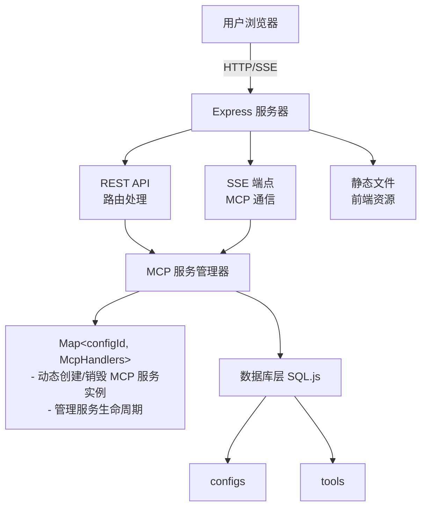
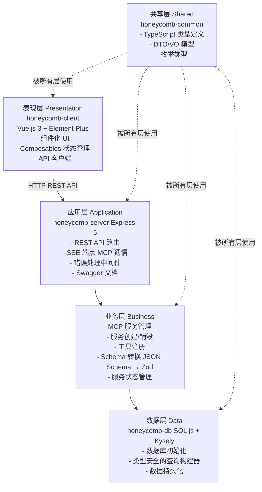
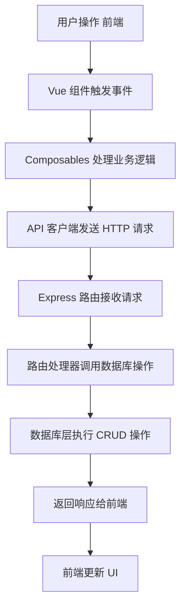
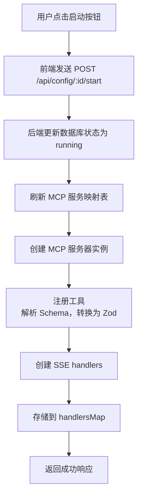
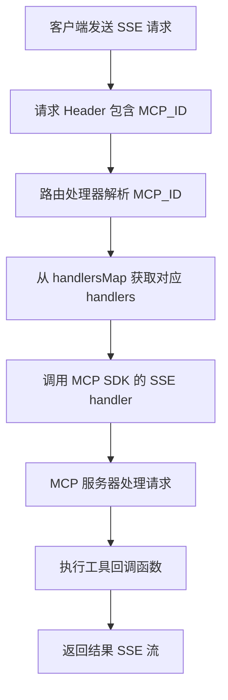

# Honeycomb 架构说明

## 📋 目录

- [整体架构](#整体架构)
- [模块说明](#模块说明)
- [数据流](#数据流)
- [核心功能](#核心功能)
- [部署架构](#部署架构)

## 项目概述

Honeycomb 是基于 Model Context Protocol (MCP) 的服务配置管理平台，采用 Monorepo 架构，使用 pnpm workspace + Turbo 进行构建和依赖管理。

## 整体架构

### 架构图



### 分层架构




## 模块说明

### 1. honeycomb-client (前端应用)

**职责**:
- 提供用户界面，展示和管理 MCP 服务配置
- 处理用户交互（创建、编辑、删除、启动、停止配置）
- 与后端 API 通信

**核心目录**:
- `api/` - API 客户端
- `components/` - Vue 组件
- `composables/` - 组合式函数
- `utils/` - 工具函数

### 2. honeycomb-server (后端服务)

**职责**:
- 提供 REST API 接口
- 管理 MCP 服务生命周期
- 处理 SSE 连接（MCP 通信）
- 服务静态文件

**核心文件**:
- `app.ts` - Express 应用配置
- `mcp.ts` - MCP 服务管理
- `routes/` - API 路由
- `middleware/` - 中间件

### 3. honeycomb-db (数据库模块)

**职责**:
- 数据库初始化和连接管理
- 提供类型安全的数据库操作接口
- 数据持久化

**数据库 Schema**:
```sql
-- 配置表
CREATE TABLE configs (
  id INTEGER PRIMARY KEY AUTOINCREMENT,
  name TEXT NOT NULL,
  version TEXT NOT NULL,
  status TEXT NOT NULL,        -- 'running' | 'stopped'
  description TEXT NOT NULL,
  created_at TEXT NOT NULL,
  last_modified TEXT NOT NULL
);

-- 工具表
CREATE TABLE tools (
  id INTEGER PRIMARY KEY AUTOINCREMENT,
  config_id INTEGER NOT NULL,
  name TEXT NOT NULL,
  description TEXT NOT NULL,
  input_schema TEXT NOT NULL,   -- JSON Schema 字符串
  output_schema TEXT NOT NULL,  -- JSON Schema 字符串
  callback TEXT NOT NULL,       -- 回调函数代码
  created_at TEXT NOT NULL,
  last_modified TEXT NOT NULL,
  FOREIGN KEY (config_id) REFERENCES configs(id) ON DELETE CASCADE
);
```

**关键特性**:
- 基于 SQL.js，无需额外数据库服务
- 使用 Kysely 提供类型安全的查询
- 支持外键约束和级联删除

### 4. honeycomb-common (共享模块)

**职责**:
- 定义共享的 TypeScript 类型
- 提供 DTO/VO 模型
- 定义枚举类型和常量

**关键特性**:
- 前后端共享类型定义，确保类型一致性
- 统一的 API 接口规范

## 数据流

### 1. 配置管理流程



### 2. MCP 服务启动流程



### 3. MCP 通信流程



## 核心功能

### 1. 配置管理
- 创建、编辑、删除 MCP 服务配置
- 支持按名称搜索和按状态筛选
- 级联删除关联工具

### 2. 服务生命周期管理
- 启动/停止服务：动态创建/销毁 MCP 服务实例
- 服务刷新：重新加载所有配置

### 3. 工具管理
- 工具注册：包含名称、描述、输入/输出 Schema 和回调函数
- Schema 转换：JSON Schema → Zod schema
- 回调执行：支持自定义 JavaScript 回调函数

### 4. MCP 协议支持
- SSE 通信：通过 Server-Sent Events 实现 MCP 协议
- 多服务支持：通过 MCP_ID header 区分不同服务

## 部署架构

### 开发环境
- Vite Dev Server (端口 5173)
- Express Server (端口 3002)
- SQL.js 数据库（本地文件）

### 生产环境
- Express 服务器：REST API、SSE 端点、静态文件服务
- SQL.js 数据库（本地文件）

**部署步骤**:
```bash
pnpm build  # 构建所有包
pnpm start  # 启动服务
```
